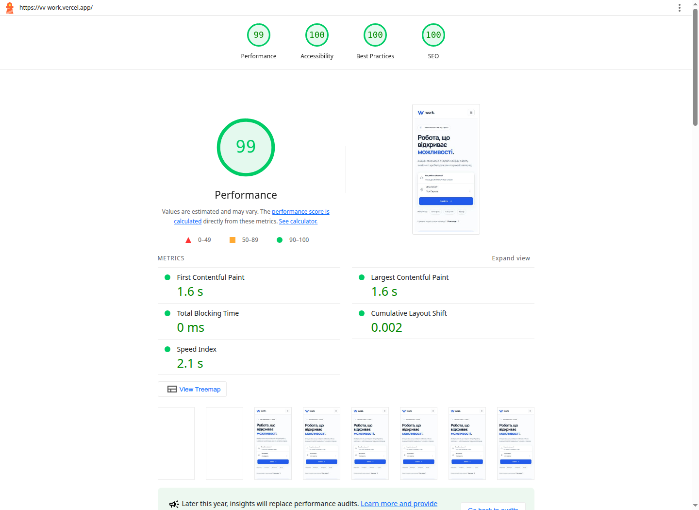

# Production-аудит

Вимірювання 14.09.2026 (Europe/Kyiv) на **https://vv-work.vercel.app/**, Lighthouse 12.8.2.
Перевірено деплой коміту `2965687`.

| Performance | Accessibility | Best Practices | SEO |
| --- | --- | --- | --- |
| 99 | 100 | 100 | 100 |

Мобільна емуляція Lighthouse 412×823, simulated throttling, CPU ×4, очищення сховища.
FCP та LCP — **1,6 с**, TBT — **60 мс**, CLS — **0,001**.
Затримку та випадкові помилки API під час Lighthouse не підмінювали.
Це лабораторне вимірювання публічного сайту; результат залежить від мережі та пристрою.



[Повний HTML-звіт](lighthouse.html) · [Lighthouse JSON](lighthouse.json) · [axe JSON](axe.json)

Axe 4.13.0: **27 перевірок, 0 порушень** (зокрема critical/serious), без помилок JavaScript
та горизонтального переповнення. Головна, партнер і контакти перевіряються на 1440/768/375 px;
додатково — мобільне меню, помилки валідації, помилка/успіх заявки, форма роботодавця,
порожній список, skeleton та error → retry → success для всіх трьох сценаріїв з асинхронними даними.
Перевіряються також фокус при валідації, Escape у меню та збереження контакту після помилки.
Лише у браузері axe випадковість фіксується для відтворення станів; код застосунку не змінюється.

У звіті збережені `incomplete`: axe не визначив контраст деяких ділянок із декоративними
накладаннями та відкритим меню. Графіку й текст переглянуто в браузері; вторинний текст
`#606c82` на `#edf2ff` має контраст понад 4,5:1. Автоматичний аудит не є повною перевіркою WCAG
і не замінює тестування зі скринрідером.

На опублікованому сайті також перевірено пошук із головної, спільну роботу фільтрів,
перехід із категорії до вакансії та заявки, відправлення телефону без повідомлення,
оновлення прямих URL, невідомі маршрути/компанії й доступність JSON та `robots.txt`.

Команди виконуйте з кореня репозиторію. Для аудиту потрібен встановлений Google Chrome:

```bash
npm ci
AUDIT_URL=https://vv-work.vercel.app npm run audit:axe
AUDIT_URL=https://vv-work.vercel.app npm run audit:lighthouse
```

Запускайте перевірки послідовно, щоб вони не конкурували за CPU.
Для локального аудиту виконайте `npm run build`, запустіть `npm run preview -- --port 4180`
і в іншому терміналі виконайте ті самі команди аудиту без `AUDIT_URL`.

Для нестандартного розташування Chrome задайте `CHROME_PATH`, наприклад
`CHROME_PATH=/opt/google/chrome/chrome npm run audit:axe`.
`AUDIT_URL` змінює базову адресу (за замовчуванням `http://127.0.0.1:4180`).
Скрипти перезаписують звіти в `docs/audits/`; axe завершується з помилкою при будь-якому
порушенні, переповненні чи помилці JavaScript, Lighthouse — якщо Performance <90.
Скриншот оновлюється окремо: відкрийте згенерований `lighthouse.html` у браузері.
